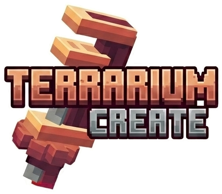

# Terrarium Launcher

<p align="center">
  
</p>

**Terrarium Launcher** — лаунчер Minecraft для приватного SMP-сервера спільноти **Terrarium Create**.
Це форк [Modrinth App](https://github.com/modrinth/code) (theseus), доопрацьований під потреби одного конкретного сервера.

> ⚠️ **Створено для гравців сервера Terrarium.**
> Лаунчер налаштований на нашу збірку модів, наш Discord і наші правила. Якщо ти не граєш на сервері Terrarium — **не рекомендуємо його завантажувати**: тобі потрібен оригінальний [Modrinth App](https://modrinth.com/app).
>
> ⚠️ **Built for the Terrarium SMP community.** This is a fork of Modrinth App tailored to one private server (our modpack, Discord, rules). If you are not a Terrarium player, **do not install this** — get the official [Modrinth App](https://modrinth.com/app) instead.

## Що додано порівняно з Modrinth App

- Головна сторінка — запуск **нашої збірки** з GitHub-релізів, з автоматичними сповіщеннями про оновлення.
- Клієнтська та серверна збірки; тестовий канал (pre-release) для адмінів і тестерів, «Поширити для всіх» одним натисканням.
- Адмін публікує оновлення збірки прямо з лаунчера: вибір модів/конфігів, зміна ядра (NeoForge), назви та іконки.
- Офлайн-акаунти (гра без входу через Microsoft).
- Групи модів — справжні підпапки `mods/<Група>/` з акордеонами, drag & drop; на час гри розкладаються в корінь і повертаються назад.
- Власне оформлення: синьо-жовта гама, карусель фото сервера, посилання на правила та Discord.

Усе інше — стандартний функціонал Modrinth App: пошук модів і збірок на Modrinth, скіни, скриншоти, бібліотека примірників.

## Завантаження

Готові збірки лаунчера — у [Releases](../../releases). Установник для Windows не підписаний сертифікатом, тому SmartScreen може показати попередження — «Докладніше → Виконати все одно».

Дані лаунчера зберігаються окремо від Modrinth App (`%APPDATA%\TerrariumLauncher`), обидва можуть стояти поруч.

## Розробка

```
scripts\dev\start.cmd      # dev-режим (Tauri + Vite, гаряче перезавантаження)
pnpm app:build             # збірка установника (target/release/bundle)
```

Вимоги ті самі, що й у Modrinth App: Node 20+, pnpm, Rust stable. Огляд архітектури наших змін — у `docs-terrarium/ARCHITECTURE.md` та в коментарях модулів `packages/app-lib/src/api/terrarium.rs`, `…/state/instances/commands/mod_groups.rs`.

## Ліцензія та подяки

Код лаунчера — [GNU GPL v3](apps/app/LICENSE), як і Modrinth App, з якого він походить. Modrinth — торгова марка Rinth, Inc.; цей проєкт не пов'язаний з Modrinth і не підтримується ними. Дякуємо команді Modrinth за відкритий код.

Launcher powered by [Modrinth](https://modrinth.com).
